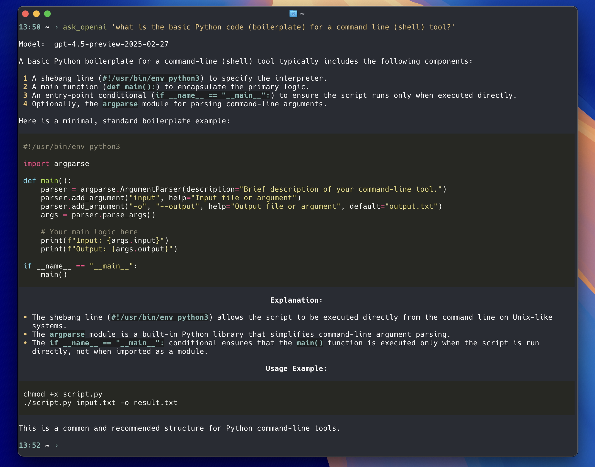

# ask LLMs in the Terminal

`ask_openai.py` – call the [OpenAI API](https://openai.com/api), fill in your `API_KEY`

`ask_ollama.py` – call the [local Ollama API](https://ollama.com/) (localhost:11434)

required:
* [prompt_toolkit](https://github.com/prompt-toolkit/python-prompt-toolkit) (input)
* [openai](https://github.com/openai/openai-python) (ask_openai.py)
* [requests](https://requests.readthedocs.io/) (ask_ollama.py)
* [rich](https://github.com/Textualize/rich) (output)

## OpenAI API

[ask_openai.py](https://github.com/haalven/LLM_terminal/blob/main/ask_openai.py) uses the [openai Python library](https://github.com/openai/openai-python) to call the [OpenAI API](https://openai.com/api). An internet connection is required. You have to insert your `API_KEY` by editing the `my_api_key = 'sk-***'` line before running the script.

Choose a specific OpenAI model by editing the `gpt_model = 'gpt-4o'` line. See also: [platform.openai.com/docs/models](https://platform.openai.com/docs/models).

## Ollama API

[ask_ollama.py](https://github.com/haalven/LLM_terminal/blob/main/ask_ollama.py) uses the [requests Python library](https://requests.readthedocs.io/) to call the [local Ollama API](https://ollama.com/) (based on [llama.cpp](https://en.wikipedia.org/wiki/Llama.cpp)). An internet connection is not required. Install Ollama first and start the local server (localhost:11434). To download LLMs use the `ollama run <model>` command.

The best general LLMs for computers with 8…16 GB of RAM in July 2024 are `gemma2` by Google (9B, 5.4GB), `llama3.1` by Meta (8B, 4.7GB), `phi3` by Microsoft (4B, 2.2GB), and `mistral` by MistralAI (7B, 4.1GB). See also: [ollama.com/models](https://ollama.com/models).

Example:

